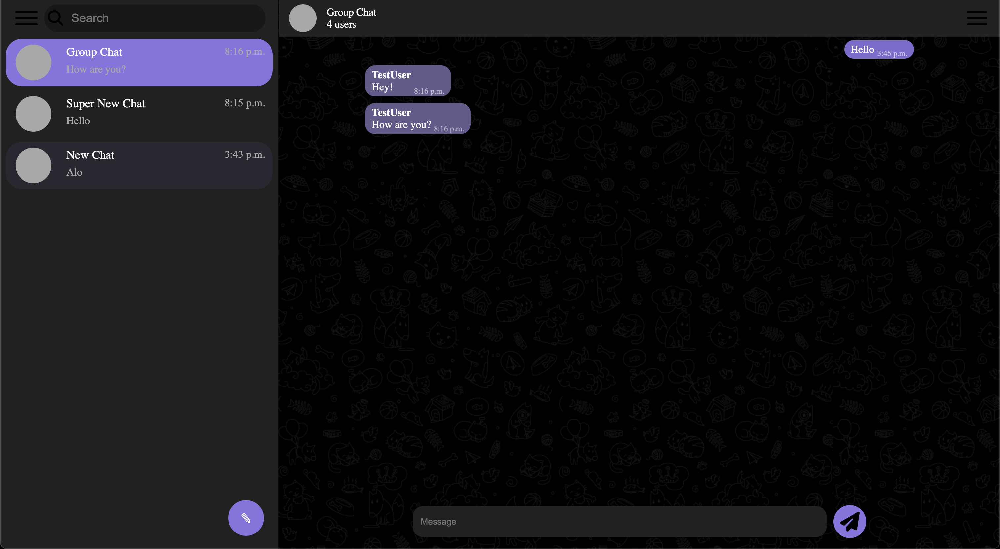

# Messanger

Django project for communication between pople in real time.

## Check it out!

[Messanger project deployed on Render](https://messanger-zj2b.onrender.com)

## Installation

Python3 must be already installed

```shell
git clone https://github.com/StreetNik/messanger
cd messanger
python3 -m venv venv
source venv/bin/activate
pip install -r requirements.txt
python manage.py runserver #Start Django Server
```

## Features

* Authentication functionality for User
* Chat between two or more users
* Possibility to create new chats
* Powerful admin panel for advanced managing

## Demo


